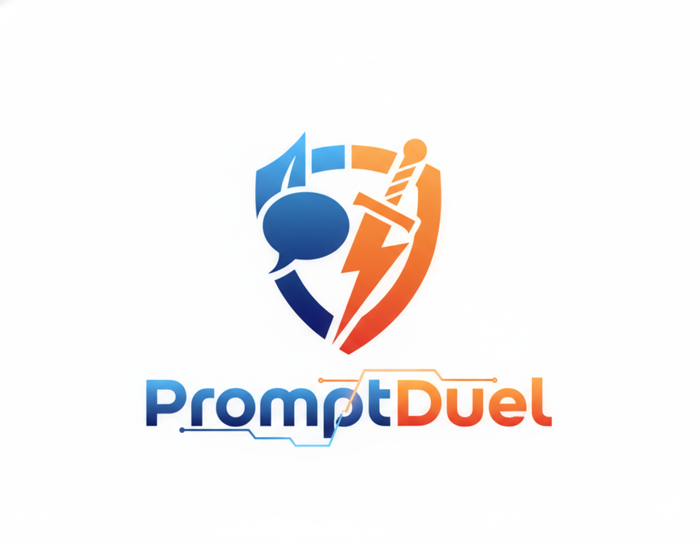
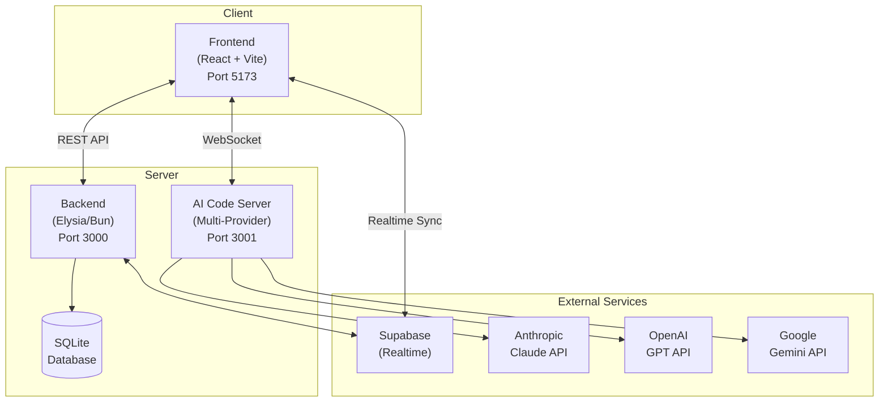

<p align="center">
  
</p>

A competitive multiplayer prompt engineering game where two players battle head-to-head to write the best prompts for AI code generation. Each player gets up to 7 prompts to complete a coding challenge - the fewer prompts used with a higher score, the better!

## What is Prompt Duel?

Prompt Duel is a real-time multiplayer game that tests your prompt engineering skills. Two players compete simultaneously, each with their own AI code generation session (choose from Anthropic Claude, OpenAI GPT, or Google Gemini). The goal is to craft effective prompts that instruct the AI to build a working solution to the given challenge.

### How It Works

1. **Register/Login** - Create an account or sign in
2. **Create or Join Room** - Start a new room or join with a code
3. **Ready Up** - Both players mark ready, host starts the game
4. **Take Turns Prompting** - Players alternate submitting prompts to the AI
5. **Watch AI Work** - See real-time terminal output as the AI builds the solution
6. **Score & Win** - Automated evaluation scores each player's solution

## Features

- **User Authentication** - Register, login, and track your progress
- **Room System** - Create private rooms with unique codes
- **Real-time Multiplayer** - WebSocket-powered live gameplay
- **Chat System** - Communicate with opponents in the waiting room
- **Spectator Mode** - Watch live games without participating
- **Leaderboard** - Global rankings filtered by challenge
- **Turn-based Gameplay** - Fair alternating prompt submission
- **Multi-Provider AI** - Choose from Anthropic Claude, OpenAI GPT, or Google Gemini
- **Live Terminal Output** - Watch AI generate code in real-time
- **Automated Scoring** - AI-powered evaluation with detailed breakdown
- **Sample Prompts** - Learn from example solutions after each game
- **Retro UI** - NES.css styled interface for that classic gaming feel
- **Docker Support** - Easy deployment with Docker Compose
- **Railway Ready** - Deploy to cloud with included configuration

## Game Mechanics

### Scoring System

Your final score is calculated as: **Raw Score × Multiplier**

The multiplier rewards efficiency - fewer prompts = higher multiplier:

| Prompts Used | Multiplier |
|--------------|------------|
| 1 prompt | 0.3× |
| 2 prompts | 0.5× |
| 3 prompts | 0.7× |
| 4 prompts | 0.85× |
| 5 prompts | 0.9× |
| 6 prompts | 0.95× |
| 7 prompts | 1.0× |

### Evaluation Categories

**Challenge 1 - BracketValidator (Beginner):**
| Category | Weight |
|----------|--------|
| Functionality / Test Cases | 40% |
| Algorithm Efficiency | 20% |
| Error Handling | 15% |
| Code Quality | 15% |
| CLI Implementation | 10% |

**Challenge 2 - QuantumHeist (Advanced):**
| Category | Weight |
|----------|--------|
| Algorithm Design & Implementation | 25% |
| Data Structures | 20% |
| Game Mechanics Implementation | 20% |
| Code Quality | 15% |
| Complexity Analysis | 10% |
| Testing & Correctness | 5% |
| Performance | 3% |
| Documentation | 2% |

### Rules

- Each player gets a maximum of **7 prompts**
- Each prompt is limited to **280 characters** (like a tweet!)
- Game has a **20-minute timer** (configurable)
- Players can **end early** if satisfied with their solution
- Turn-based gameplay ensures fair competition
- Host can end duel early (forfeit rules apply if opponent hasn't finished)

### Challenges

| Challenge | Difficulty | Description |
|-----------|------------|-------------|
| Challenge 1 | Beginner | **BracketValidator** - Build a CLI tool using stack-based bracket validation |
| Challenge 2 | Advanced | **QuantumHeist** - Build a terminal pathfinding puzzle game with Dijkstra's algorithm |

## Demo

[](https://youtu.be/YKa3vlg4jPs)

## Tech Stack

| Layer | Technology |
|-------|------------|
| Frontend | React, Vite, TypeScript, NES.css, Tailwind CSS |
| Backend | Bun, Elysia, Drizzle ORM, SQLite |
| Real-time | Supabase Realtime, WebSocket |
| AI Code Generation | Node.js, WebSocket (ws), Multi-provider AI API (Anthropic, OpenAI, Google) |
| Deployment | Docker, Docker Compose, Railway |

## Architecture



## Quick Start

### Prerequisites

- [Node.js](https://nodejs.org/) v20+
- [Bun](https://bun.sh/) (for backend)
- [Anthropic API Key](https://console.anthropic.com/) (and/or OpenAI, Google API keys)
- [Supabase Account](https://supabase.com/) (for real-time sync)

### 1. Clone and Install

```bash
git clone https://github.com/kenken64/PromptDuel.git
cd promptduel

# Install dependencies
cd frontend && npm install && cd ..
cd backend && bun install && cd ..
cd ai-code-server && npm install && cd ..
```

### 2. Configure Environment

```bash
cp .env.example .env
# Edit .env and add your keys:
# - ANTHROPIC_API_KEY
# - SUPABASE_URL
# - SUPABASE_ANON_KEY
```

### 3. Setup Database

```bash
cd backend && bun run db:setup
```

### 4. Start Services

**Windows (PowerShell):**
```powershell
.\scripts\start-all.ps1
```

**Unix/Mac:**
```bash
bash scripts/start-all.sh
```

### 5. Play!

Open http://localhost:5173 in your browser.

## Docker Deployment

```bash
# Copy and configure environment
cp .env.example .env
# Add your ANTHROPIC_API_KEY and Supabase keys to .env

# Build and run all services
docker-compose up --build

# Access at http://localhost
```

## Cloud Deployment (Railway)

See [RAILWAY.md](./RAILWAY.md) for detailed deployment instructions.

**Quick overview - 3 services required:**

| Service | Directory | Port |
|---------|-----------|------|
| Frontend | `frontend/` | 80 |
| Backend | `backend/` | 3000 |
| AI Code Server | `ai-code-server/` | 3001 |

## Project Structure

```
promptduel/
├── frontend/               # React + Vite frontend
│   ├── src/
│   │   ├── components/     # React components
│   │   ├── contexts/       # Auth, Room, Game contexts
│   │   ├── pages/          # Page components
│   │   ├── config.ts       # API configuration
│   │   └── gameRules.ts    # Scoring logic
│   └── Dockerfile
├── backend/                # Elysia/Bun API server
│   ├── src/
│   │   ├── db/             # Database schema & setup
│   │   ├── routes/         # API routes (auth, rooms, chat)
│   │   ├── ws/             # WebSocket handlers
│   │   ├── middleware/     # Auth middleware
│   │   ├── evaluate.ts     # Solution evaluation
│   │   └── index.ts        # Main entry point
│   └── Dockerfile
├── ai-code-server/     # AI Code Generation WebSocket server
│   ├── index.js            # WebSocket server & session manager
│   ├── providers/          # Multi-provider AI integrations
│   │   ├── AnthropicProvider.js  # Anthropic Claude API
│   │   ├── OpenAIProvider.js     # OpenAI GPT API
│   │   ├── GoogleProvider.js     # Google Gemini API
│   │   ├── BaseProvider.js       # Base provider interface
│   │   ├── ProviderFactory.js    # Provider instantiation factory
│   │   └── config.js             # Provider configuration
│   └── Dockerfile
├── workspaces/             # Player workspace files (auto-created)
├── scripts/                # Start/stop scripts
├── PRDs/                   # Product Requirements Documents
├── docker-compose.yml      # Docker orchestration
├── RAILWAY.md              # Railway deployment guide
└── CLAUDE.md               # Project documentation
```

## Environment Variables

| Variable | Service | Description |
|----------|---------|-------------|
| `ANTHROPIC_API_KEY` | ai-code-server | Anthropic Claude API key (at least one provider required) |
| `OPENAI_API_KEY` | ai-code-server | OpenAI GPT API key (optional) |
| `GOOGLE_AI_API_KEY` | ai-code-server | Google Gemini API key (optional) |
| `SUPABASE_URL` | frontend | Supabase project URL |
| `SUPABASE_ANON_KEY` | frontend | Supabase anonymous key |
| `JWT_SECRET` | backend | Secret for JWT signing |
| `DATABASE_URL` | backend | SQLite database path |
| `WORKSPACES_DIR` | ai-code-server | Player workspace directory |
| `VITE_API_URL` | frontend | Backend API URL |
| `VITE_WS_URL` | frontend | WebSocket server URL |

## API Endpoints

### Authentication
| Endpoint | Method | Description |
|----------|--------|-------------|
| `/auth/register` | POST | Create new account |
| `/auth/login` | POST | Login and get JWT |
| `/auth/logout` | POST | Invalidate session |
| `/auth/me` | GET | Get current user |

### Rooms
| Endpoint | Method | Description |
|----------|--------|-------------|
| `/rooms` | GET | List all rooms |
| `/rooms` | POST | Create new room |
| `/rooms/:code` | GET | Get room details |
| `/rooms/:code/join` | POST | Join as player |
| `/rooms/:code/spectate` | POST | Join as spectator |
| `/rooms/:code/ready` | POST | Toggle ready status |
| `/rooms/:code/start` | POST | Start game (host only) |

### Game
| Endpoint | Method | Description |
|----------|--------|-------------|
| `/evaluate` | POST | Evaluate both players |
| `/evaluate-player` | POST | Evaluate single player |
| `/leaderboard` | GET | Get all rankings |
| `/leaderboard/:challenge` | GET | Get challenge rankings |
| `/leaderboard` | POST | Add leaderboard entry |
| `/challenge-prompts/:challenge` | GET | Get sample prompts |

## Database Schema

```sql
-- Core tables
users (id, username, email, password_hash, last_login_at, created_at)
sessions (id, user_id, token, expires_at, created_at)
rooms (id, code, host_id, challenge, status, player1_id, player2_id, player1_ready, player2_ready, created_at)
room_spectators (id, room_id, user_id, joined_at)
chat_messages (id, room_id, user_id, message, created_at)
leaderboard (id, player_name, challenge, score, max_score, percentage, grade, prompts_used, created_at)
challenge_prompts (id, challenge, prompt_number, title, content, created_at)
```

## Contributing

Contributions are welcome! Please feel free to submit a Pull Request.

1. Fork the repository
2. Create your feature branch (`git checkout -b feature/amazing-feature`)
3. Commit your changes (`git commit -m 'Add some amazing feature'`)
4. Push to the branch (`git push origin feature/amazing-feature`)
5. Open a Pull Request

## Documentation

- [Product Requirements Document](./PRDs/PRD-PromptDuel-v1.0.md)
- [Railway Deployment Guide](./RAILWAY.md)
- [Project Overview](./CLAUDE.md)

## License

MIT License - see [LICENSE](./LICENSE) for details.

---

Built with Claude Code
