# Prompt Duel - Codebase Understanding

<p align="center">
  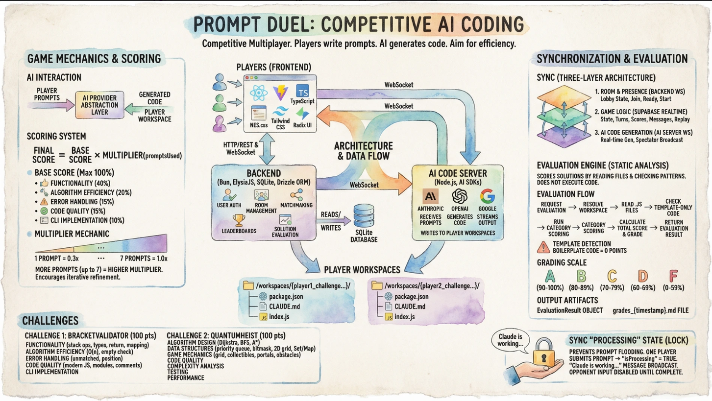
</p>

## 1. Project Overview
**Prompt Duel** is a competitive multiplayer game where two players battle to write the most efficient prompts for AI code generation. Players are given a coding challenge and must instruct the AI to solve it using as few prompts as possible.

## 2. Technology Stack
The project is a monorepo divided into three main services:

### **Frontend** (`/frontend`)
*   **Framework**: React 18 + Vite + TypeScript
*   **Styling**: NES.css (retro gaming aesthetic) + Tailwind CSS + Radix UI
*   **State Management**: React Context (`GameContext`, `RoomContext`, `AuthContext`)
*   **Routing**: React Router DOM v6
*   **Communication**: HTTP (Backend) + WebSockets (Terminal Server)

### **Backend** (`/backend`)
*   **Runtime**: Bun
*   **Framework**: ElysiaJS
*   **Database**: SQLite with Drizzle ORM
*   **Role**: Handles user authentication, room management, matchmaking, leaderboards, and solution evaluation.

### **AI Code Server** (`/ai-code-server`)
*   **Runtime**: Node.js
*   **Key Libraries**:
    *   `@anthropic-ai/sdk`, `openai`, `@google/generative-ai`: Multi-provider AI SDKs.
    *   `ws`: WebSocket server for real-time communication.
*   **Role**: Receives prompts from players, generates code via AI provider APIs (Anthropic, OpenAI, Google), writes code to player workspaces, and streams output to the frontend in real-time.

## 3. Architecture & Data Flow

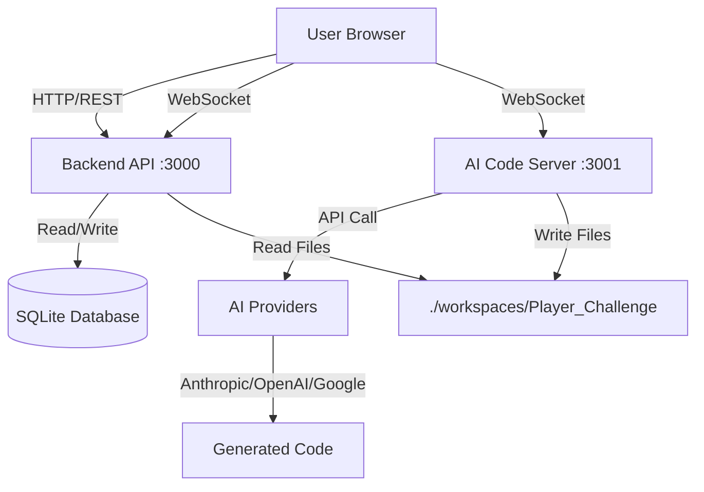

1.  **Rooms**: Players allow the Backend to match them into a room.
2.  **Session Start**: The Frontend connects to the AI Code Server via WebSocket to start a session.
3.  **Game Loop**:
    *   Players submit a prompt text.
    *   The ACS sends the prompt to the selected AI provider API.
    *   Generated code is written to the workspace and output is streamed back to the client.
4.  **Evaluation**: The Backend reads the files generated in the workspace to score the solution.

## 4. Key Directories & Files

### Root
*   `scripts/`: Automation scripts for starting/stopping all services (Windows/Unix).
*   `workspaces/`: Dynamic directory where player projects are generated.
*   `docker-compose.yml`: Container orchestration.

### Backend (`/backend/src`)
*   `index.ts`: Main API entry point and routes.
*   `ws/roomServer.ts`: WebSocket logic for room coordination.
*   `evaluate.ts`: Logic to check player solutions against test cases.
*   `db/schema.ts`: Drizzle ORM schema definitions (Users, Prompts, Duels, Leaderboard).

### AI Code Server (`/ai-code-server`)
*   `index.js`: The core logic.
    *   Manages WebSocket sessions per player.
    *   Routes prompts to the selected AI provider (Anthropic/OpenAI/Google).
    *   Writes generated code to player workspaces.
    *   Streams output to spectators.
*   `providers/`: Multi-provider AI integration layer.
    *   `ProviderFactory.js`: Factory pattern for provider instantiation.
    *   `AnthropicProvider.js`, `OpenAIProvider.js`, `GoogleProvider.js`: Provider implementations.

### Frontend (`/frontend/src`)
*   `pages/GamePage.tsx`: The main game UI orchestration.
*   `contexts/GameContext.tsx`: "God object" managing the complex game state, timers, and socket events.
*   `components/UnifiedPromptArea.tsx`: The mechanism for submitting prompts.
*   `gameRules.ts`: Client-side scoring logic display.

## 5. Game Mechanics

### Workspaces
The system isolates players by creating unique directories in `/workspaces/{player_name}_challenge{id}/`.
Each workspace is initialized with:
*   `package.json`: Basic Node.js project setup.
*   `CLAUDE.md`: Instructions for Claude on how to behave (e.g., "Only implement what is asked").
*   `index.js`: A starter file.

### Interacting with AI Providers
The AI Code Server uses a provider abstraction layer to send prompts to the selected AI provider API. Each provider (Anthropic Claude, OpenAI GPT, Google Gemini) implements a common interface for code generation. The server sends the player's prompt along with challenge context as a system prompt, receives generated code, and writes it to the player's workspace.

### Scoring
*   **Base Score**: Calculated by the backend (`evaluate.ts`) based on:
    *   Functionality (40%)
    *   Algorithm Efficiency (20%)
    *   Error Handling (15%)
    *   Code Quality (15%)
    *   CLI Implementation (10%)
*   **Multiplier**: A counter-intuitive mechanic where **using MORE prompts is better**.
    *   Rationale: Encourages iterative refinement over "lucky" one-shotting or copy-pasting.
    *   7 Prompts (Max): **1.0x** (Full Score)
    *   1 Prompt: **0.3x** (Severe Penalty)
    *   *Formula*: `FinalScore = BaseScore * Multiplier(promptsUsed)`

## 6. Setup & Running

**Prerequisites**: Node.js v20+, Bun, Anthropic API Key.

**Start All Services**:
*   **Windows**: `.\scripts\start-all.ps1`
*   **Mac/Linux**: `./scripts/start-all.sh`

**Environment Variables**:
*   `ANTHROPIC_API_KEY`: Required for Anthropic provider (at least one provider API key needed).

## 7. Synchronization & Networking

Prompt Duel uses a **Three-Layer Synchronization details** architecture to manage the complex state between two players and spectators.

### 1. Room & Presence (Backend WebSocket)
**Endpoint**: `/ws/room`
**Role**: Manages "Lobby" state.
*   **Events**: `join-room`, `player-joined`, `ready-toggle`, `game-start`.
*   **Mechanism**: The Backend maintains a map of rooms and connected clients. It broadcasts presence updates to all connected clients in a room. This is how players know when their opponent has joined or is ready.

### 2. Game Logic (Supabase Realtime)
**Endpoint**: `supbabase.channel()`
**Role**: Manages "Game" state (Turns, Scores, Messages).
*   **Events**: Turn switching (`TURN:player1`), Score updates (`SCORE_UPDATE`), Game over (`GAME_END`).
*   **Mechanism**: The application leverages `GameContext` to subscribe to Supabase channels. Crucial game state changes (like passing the turn after a prompt is processed) are synced via system messages in the database, which Supabase pushes to all clients.
    *   *Why?* This ensures a persistent log of the game state and allows spectators to "replay" the logic by reading the message history.

### 3. AI Code Generation (AI Code Server WebSocket)
**Endpoint**: `ws://localhost:3001`
**Role**: Manages real-time AI code generation.
*   **Players**: Connect to start a session (`start-session`) with their selected AI provider.
    *   Input: Frontend -> ACS -> AI Provider API
    *   Output: AI Provider API -> ACS -> Frontend
*   **Spectators**: Connect to ACS via `spectate-session`.
    *   The ACS broadcasts generation output from active sessions to any connected spectators.

### 4. Connection Lifecycle (Server Cleanup)
To prevent memory leaks and zombie rooms, the Backend runs a background job every **5 minutes**:
*   **Stale Clients**: Removes any client whose WebSocket `readyState` is not `OPEN`.
*   **Empty Rooms**: Deletes any room that has 0 players and 0 spectators.

## 8. Game Scenarios & Race Conditions

The following diagrams illustrate how the system handles complex multiplayer scenarios.

### Scenario A: Both Players Complete All 7 Prompts
When both players exhaust their allowed prompts (7 max), the game automatically triggers the end-game evaluation.

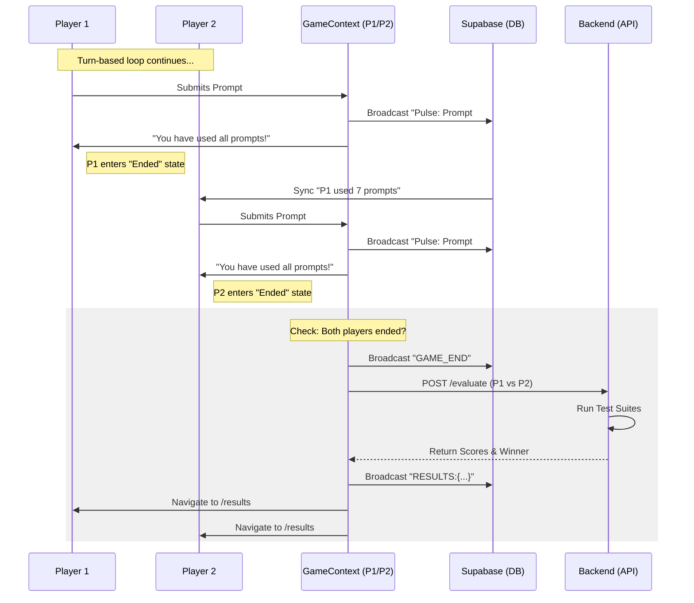

### Scenario B: Concurrent "End Early" (Race Condition)
If both players decide to "End Duel" at nearly the same time, the system uses the first processed `GAME_END` message as the source of truth.

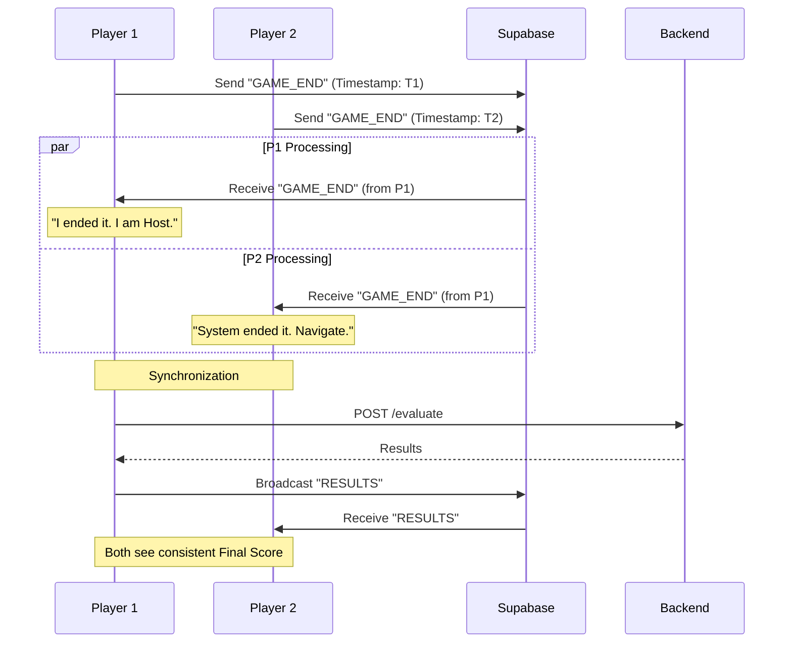

### Scenario C: Disconnection Handling
What happens if a player disconnects mid-turn?

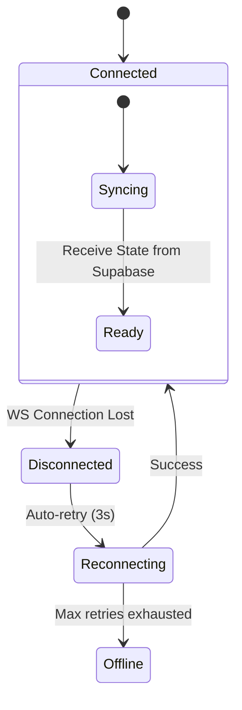

### Scenario D: Host Forfeit (Early Exit)
If the Host (Player 1) manually ends the game *before* Player 2 has finished their prompts, it is treated as a forfeit.

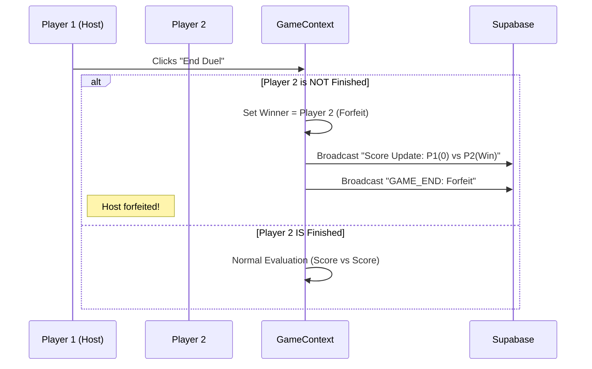

### Scenario E: Time Expiration (Timeout)
Global timer synchronization is critical. The game monitors `timeLeft` on both clients.

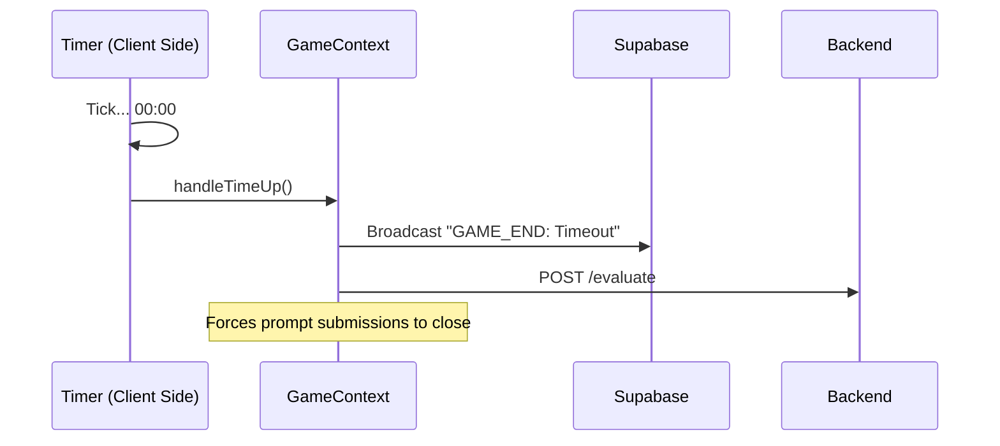

## 9. Evaluation Engine

The evaluation engine (`backend/src/evaluate.ts`) is a **static analysis** system that scores player solutions by reading workspace files and checking for the presence of specific code patterns. It does **not** execute the code.

### Evaluation Flow

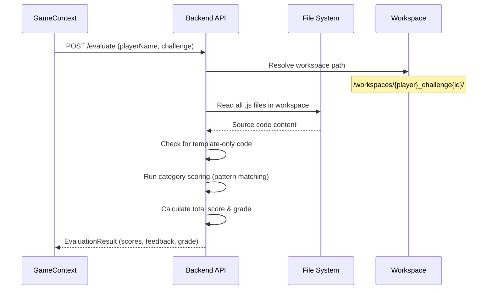

### Scoring Pipeline

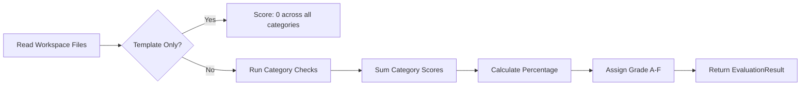

### Template Detection

Before scoring, the engine checks if the workspace contains only boilerplate code. A submission is considered **template-only** if:
- No `.js` files exist in the workspace
- Code contains `"// Your code goes here"` and is under 300 characters (Challenge 1) or 400 characters (Challenge 2)
- Code contains `"Hello from"` (default starter content)
- Total code length is under 200 characters (Challenge 1) or 300 characters (Challenge 2)

Template-only submissions receive **0 points** across all categories.

### Challenge 1: BracketValidator (100 points)

Static analysis checks for bracket validation implementation patterns:

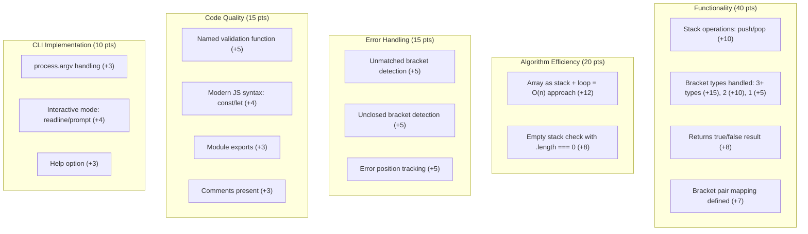

### Challenge 2: QuantumHeist (100 points)

Static analysis checks for pathfinding game implementation patterns:

| Category | Max | Key Patterns Checked |
|----------|-----|---------------------|
| Algorithm Design | 25 | Dijkstra (distance + visited), BFS (queue + visited), A* (heuristic + priority), path reconstruction, neighbor exploration |
| Data Structures | 20 | Priority queue/MinHeap, bitmask state tracking (`<<`, `&`, `\|`), 2D grid access, Set/Map usage |
| Game Mechanics | 20 | Grid parsing, collectible system (gem/key), portal teleportation, laser/door obstacles, start/end detection |
| Code Quality | 15 | Class-based design, 3+ named functions, ES6+ syntax, module exports, code organization |
| Complexity Analysis | 10 | Time complexity `O(...)` documented, space complexity documented |
| Testing | 5 | Test cases with expect/assert, example runs |
| Performance | 3 | Memoization/caching, early returns |
| Documentation | 2 | JSDoc comments, 5+ inline comments |

### Grading Scale

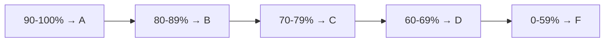

### Final Score Calculation

The final score combines the raw evaluation score with a **prompt efficiency multiplier** (defined in `frontend/src/gameRules.ts`):

```
FinalScore = RawScore × Multiplier(promptsUsed)
```

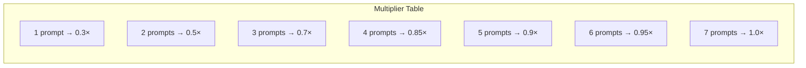

> **Design rationale**: Using more prompts yields a higher multiplier, encouraging iterative refinement over "lucky" one-shot attempts.

### Output Artifacts

After evaluation, the engine can generate:
- **EvaluationResult object**: Returned to the frontend with per-category scores, feedback, and overall grade
- **Grades Markdown file**: Saved to `/workspaces/grades_{timestamp}.md` with a comparison table of both players

## 10. Sync "Processing" State (Turn Integrity)
To prevent prompt flooding or turn-skipping, the system enforces a strict "Processing" lock.

*   **Trigger**: `processing-started` event from AI Code Server.
*   **Action**: 
    1.  Sets `isProcessing = true` locally.
    2.  Broadcasts `Claude is working...` via Supabase.
    3.  Opponent receives message -> Sets `opponentProcessing = true` -> Disables Input.
    4.  **Result**: Neither player can submit until `processing-complete` is received.
